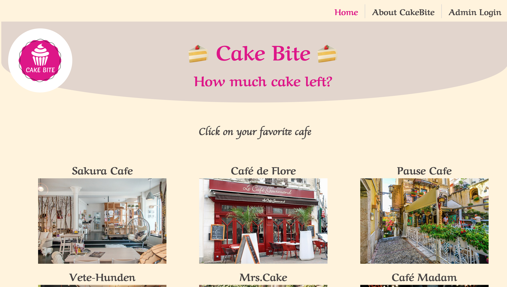

# CakeBite

This is the graduation work of the Medieinstitutet.

Users can click on their favorite cafe and check the remaining amount of cake before visiting the shop.

The contracted café owner can log in from Admin, enter the increase or decrease in inventory, and save it in the database.

In the future, the cafe's cash register and database will be linked, and the cash register data will be automatically sent to the backend. In other words, the owner logs in and increases the inventory only when the cake is made.

## Demo

[CakeBite: Youtube](https://youtu.be/yYsH0FoCzNM)



## Admin login

The password is the first letter of the cafe name converted to lowercase.
Please try them.

```sh
user name: Sakura       password: sakura

user name: Flore        password: flore

user name: Pause        password: pause

user name: Vete-hunden  password: vete

user name: Mrs.Cake     password: mrs

```

## Architecture

Frontend framework: Vue.js

Backend: Node.js (framework: Express)

Database: MySQL

Deployment:
[Netlify](https://www.netlify.com/)(frontend) and [Railway](https://railway.app/)(backend)

## Notice

This template should help get you started developing with Vue 3 in Vite.

If MySQL crashes, you have to wait a bit before restarting it so the port is available again.

Since I am deploying with railway free plan, the backend cannot be used from the 20th to the end of the month.

Therefore, the page will be different from usual during that period.

## Project Setup

```sh
npm install

npm install -D sass-loader sass

npm install axios

npm install dotenv --save

npm install element-plus --save　# for the slide-show plug-in:

backend : npm install mysql2

backend : npm install cors

```

### Compile and Hot-Reload for Development

```sh
backend : PORT=3001 npm start or　npm start

frontend : npm run dev
```

### Type-Check, Compile and Minify for Production

```sh
npm run build
```
